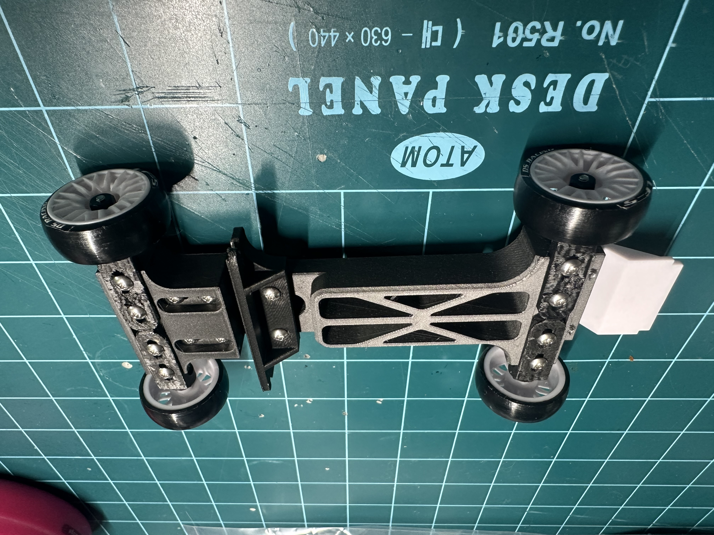

# Mini-Z Universal Dummy Frame (90mm-102mm Adjustable)

Professional-grade adjustable dummy frame for Kyosho Mini-Z body fitting, painting, and display. This project provides high-precision engineering drawings for both CNC machining and 3D printing.

## 🚀 Key Features
- **Adjustable Wheelbase:** Supports 90mm, 94mm, 98mm, and 102mm setups.
- **Wide/Narrow Compatible:** Designed to verify fitment for both standard and wide-body kits (e.g., HRC Wide Body).
- **Manufacturing Ready:** Includes full technical drawings (PDF) with tolerances for AL6061 CNC machining.
- **Surface Finish:** Optimized for sanded black gloss anodizing.

## 📂 Project Structure
- `/Drawings`: Full set of technical drawings (Assembly & Part Drawings).
- `/Photos`: Verified 3D printed samples and body fitting examples (Supra A90).

## 🛠 Specifications
- **Material:** AL6061 (Aluminum) or 3D Printing (PLA/PETG/Resin)
- **Hardware:** M2 Bolts & Taps
- **Compatibility:** All Kyosho Mini-Z AWD/FWD wheelbases

## 📸 Proof of Concept

| 94mm Setup (Toyota 86) | 3D Printed Sample |
| :---: | :---: |
|  |  |

### Functional Preview

## ⚖️ License
This project is shared for the Mini-Z community. Feel free to use, modify, and share.

---
**Designed by JWKim**
*Precision Mechanical Design for RC Enthusiasts*
