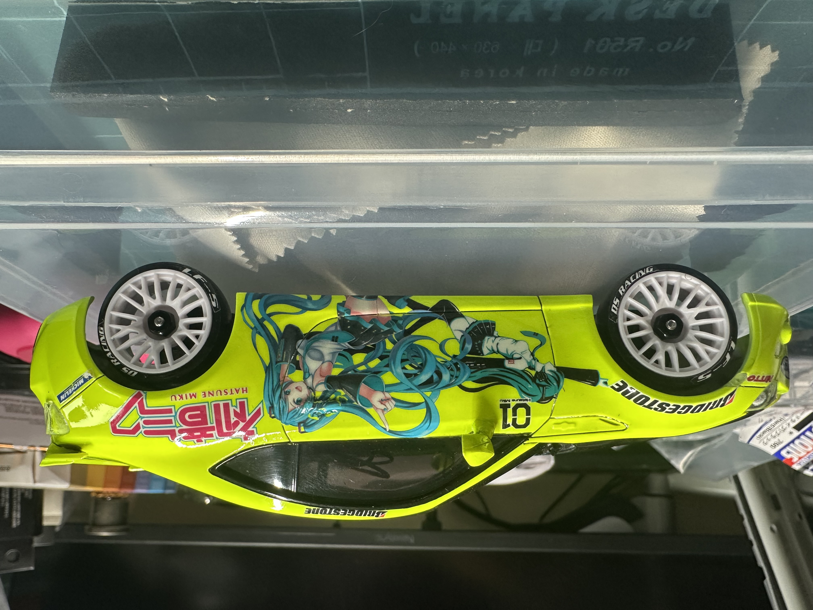
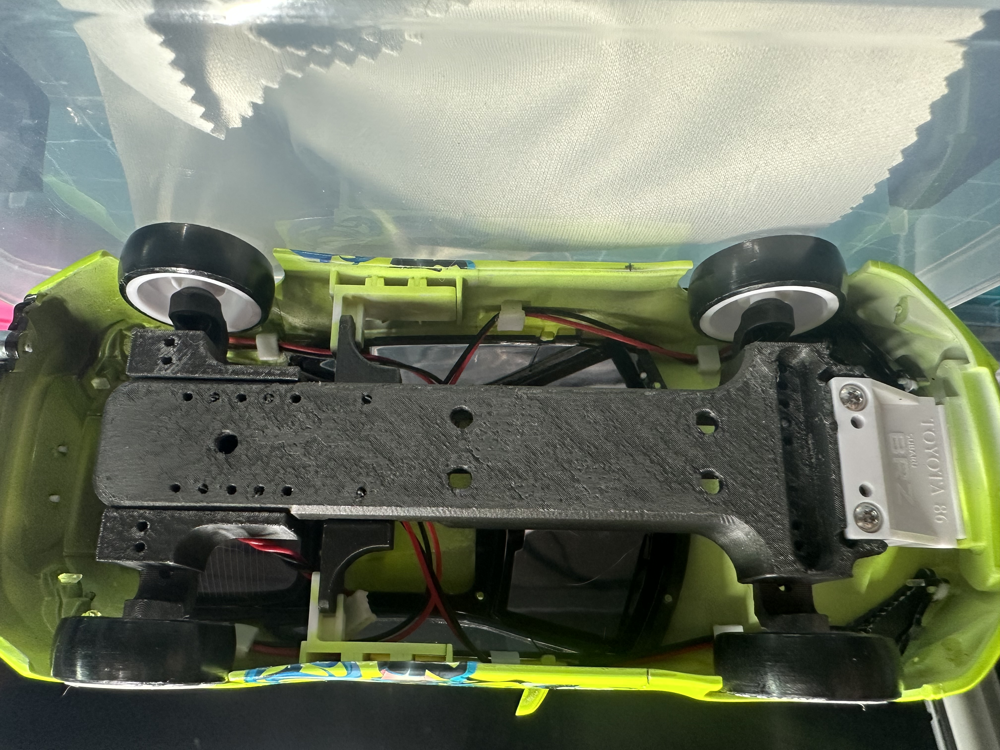
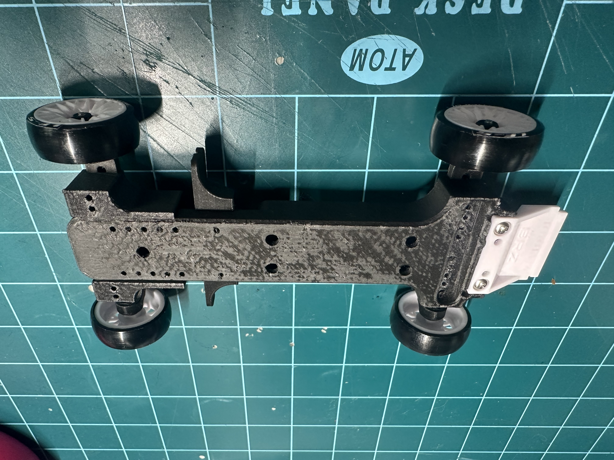
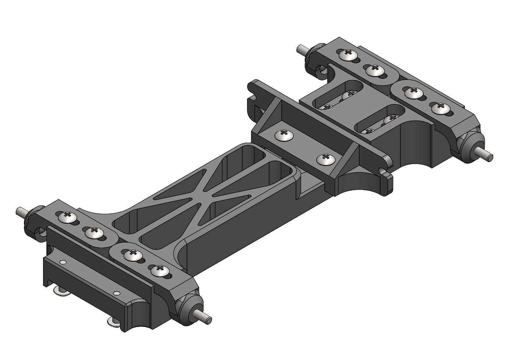
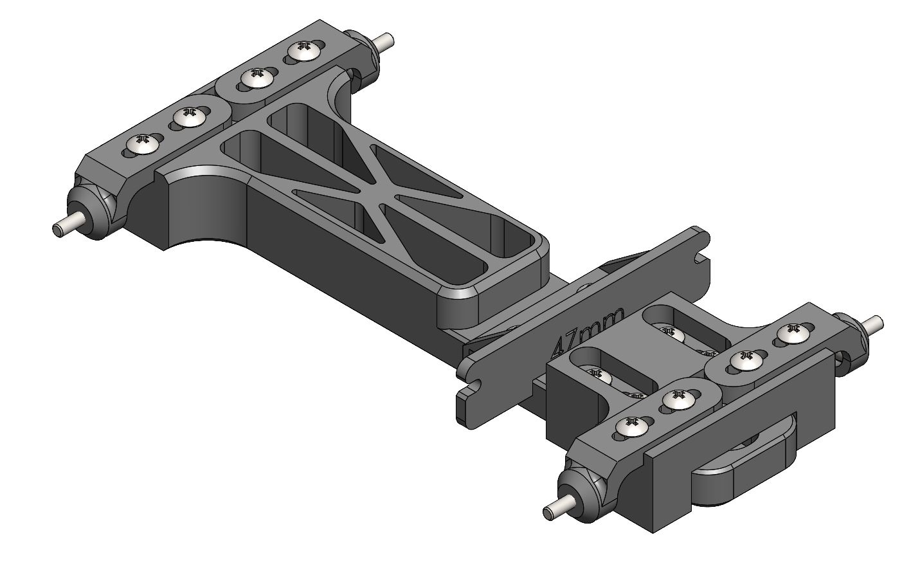
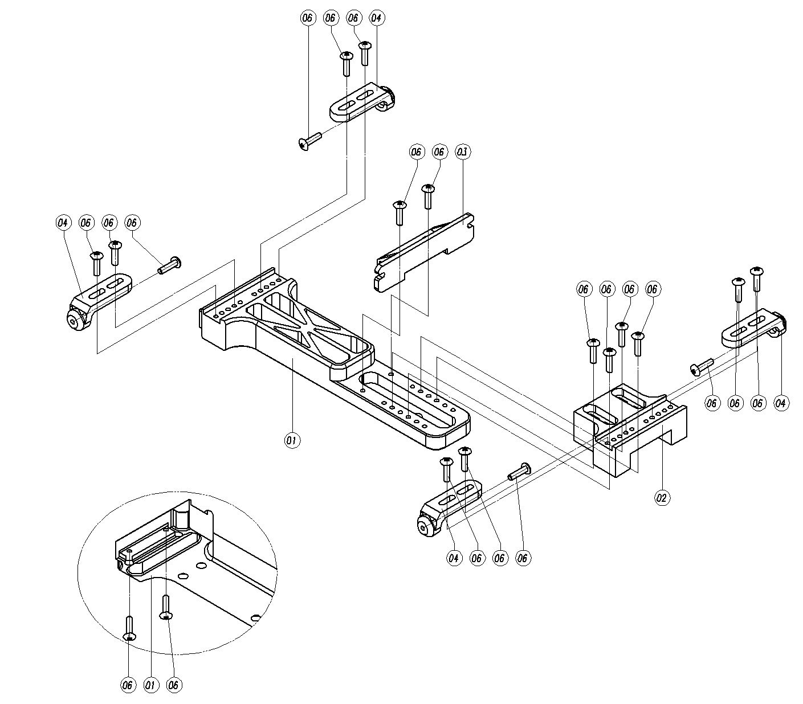
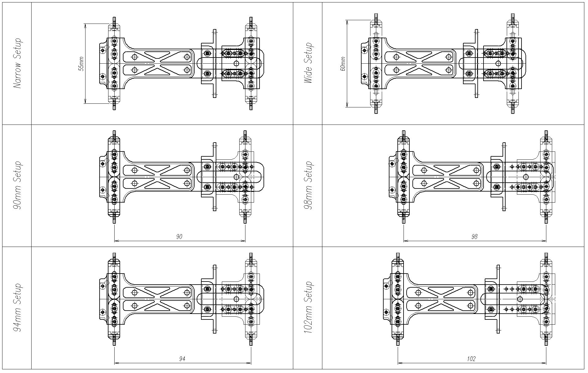

# Mini-Z Universal Dummy Frame (90mm-102mm Adjustable)

Professional-grade adjustable dummy frame for Kyosho Mini-Z body fitting, painting, and display. This project provides high-precision engineering drawings for both CNC machining and 3D printing.

## 🚀 Key Features
- **Adjustable Wheelbase:** Supports 90mm, 94mm, 98mm, and 102mm setups.
- **Wide/Narrow Compatible:** Designed to verify fitment for both standard and wide-body kits (e.g., HRC Wide Body).
- **Manufacturing Ready:** Includes full technical drawings (PDF) with tolerances for AL6061 CNC machining.
- **Surface Finish:** Optimized for sanded black gloss anodizing.

## 📂 Project Structure
- `/Drawings`: Full set of technical drawings (Assembly & Part Drawings).
- `/Photos`: Verified 3D printed samples and body fitting examples (Toyota 86).

## 🛠 Specifications
- **Material:** AL6061 (Aluminum) or 3D Printing (PLA/PETG/Resin)
- **Hardware:** M2 Bolts & Taps
- **Compatibility:** All Kyosho Mini-Z AWD/FWD wheelbases

## 📸 Proof of Concept

| 94mm Setup (Toyota 86)_Top | 94mm Setup (Toyota 86)_Under |
| :---: | :---: |
|  |  |

| 3D Printed Sample_Top | 3D Printed Sample_Under |
| :---: | :---: |
|  |  |

### Functional Preview

## 🛠️ Assembly & Setup Guide

To help you get started quickly, please refer to the assembly layout and setup sheet below:

### 1. Assembly Layout

*Exploded view for clear component positioning.*

### 2. Setup Sheet (Wheelbase & Width)

*Quick reference for 90mm, 94mm, 98mm, and 102mm configurations.*

## ⚖️ License
This project is shared for the Mini-Z community. Feel free to use, modify, and share.

---
**Designed by JWKim**
*Precision Mechanical Design for RC Enthusiasts*

